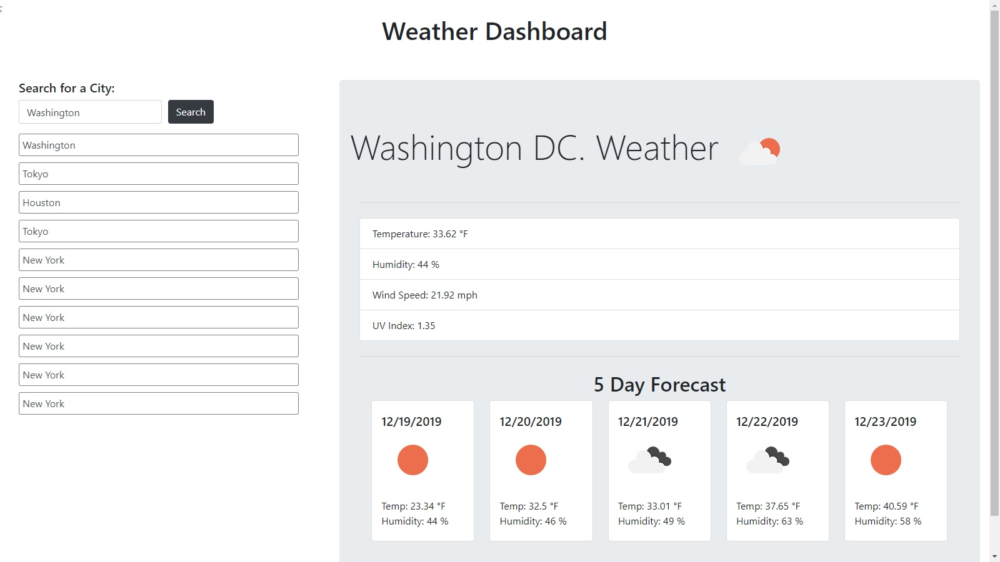

# Weather Dashboard

#### Weather_Dashboard, 12/18/19

#### By Andres Glasener

## Description
Weather Dashboard is a browser based app that alows the user to view the weather conditions at whatever city they choose. The selected city's current weather as well as the 5 day forecast will be shown. Seen below.

## Features

* Users can enter city name in search bar and see present weather conditions, including:
    - Temperature
    - Humidity
    - Wind Speed
    - UV Index
* Users can enter city name in search bar and see a 5 day forecast that inludes:
    - Temperature
    - Humidity
* Users see appropriate weather icons for the weather conditions.
* Users' last 10 items in their search history are saved in their local storage and shown below search bar for easy selection.

## Setup/Installation Requirements

* Click the link below to access the app: https://aglasener.github.io/Weather_Dashboard/

## Known Bugs

None

## Support and contact details

Please email me for further questions at andresglasener@gmail.com.

## Technologies Used

HTML

CSS

Javascript

jQuery

Bootstrap